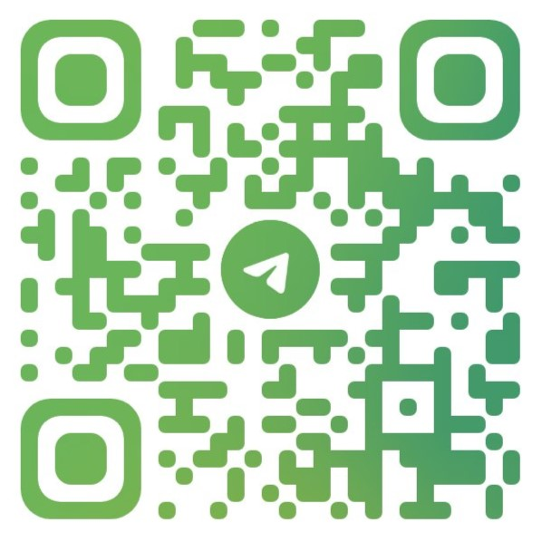

# Infobus Bot (Telegram)

Un bot de Telegram que permite consultar el tiempo de espera de los autobuses de Vitrasa en Vigo.

Bot actualmente operativo en la cuenta [`@infobus_vigo_bot`](https://t.me/infobus_vigo_bot) de Telegram.

## ¿Por qué?

1. Moovit no tiene soporte oficial por la empresa ni el Concello. Y tiene anuncios muy molestos (que hay que pagar por
   quitar).
2. Acordarse de los códigos de parada y entrar a Infobus[^1] por URL
   es un rollazo.
3. Vitrasa no da una API oficial que haría esto mucho más fácil e interoperable.
4. Porque puedo.

## Cómo funciona

De primeras, el bot no tiene base de datos ni nada. Está programado en .NET 7 con C# y utiliza las bibliotecas listadas
en el archivo [BotVitrasa.csproj](BotVitrasa.csproj). El bot se ejecuta en un servidor Linux como servicio del sistema.

- Para consultar el tiempo de espera de los autobuses de Vitrasa el bot hace una petición a Infobus, escanea el HTML y
  devuelve los resultados en texto por mensaje de Telegram.
- Para buscar paradas por nombre el bot utiliza el dataset JSON del Concello de Vigo[^2] con las paradas de Vitrasa.

## Funcionalidades

- [X] Consultar el tiempo estimado de llegada de los autobuses de Vitrasa en una parada concreta.
- [X] Buscar paradas por nombre.
- [ ] Buscar paradas por ubicación.
- [ ] Interfaz con botones para facilitar la interacción con el bot.
- [ ] Aviso cuando se publiquen anuncios en [vitrasa.es](https://vitrasa.es).
- [ ] Hacer un logo en condiciones, y quizás otro nombre.
- [ ] Hacer una "caché" de las estimaciones para no hacer más de 1 petición por parada/minuto.
- [ ] Soporte para otras plataformas de mensajería.

## Licencia

Este proyecto está licenciado bajo la licencia BSD 3-Clause. Es una licencia muy sencilla de leer y con unas condiciones
más que razonables (dame crédito, no digas que apoyo tu proyecto y no me hago responsable si algo está roto). Puedes leer la
licencia completa en el archivo [LICENCE](LICENCE).

El contenido que devuelve el bot es propiedad de sus respectivos dueños, y no me hago responsable de que sea o no exacto,
o de los daños que pueda causar su uso. Los datos del Concello están bajo la Open Data Commons Attribution License.

## Inspiración

- [Vitrasa Telegram Bot](https://github.com/dpeite/VitrasaTelegramBot)
- [Time for VBus API](https://github.com/abdonrd/time-for-vbus-api)

[^1]: `http://infobus.vitrasa.es:8002/Default.aspx?parada=` + código de parada
[^2]: [Dataset de paradas de Vitrasa](https://datos.vigo.org/data/transporte/paradas.json)